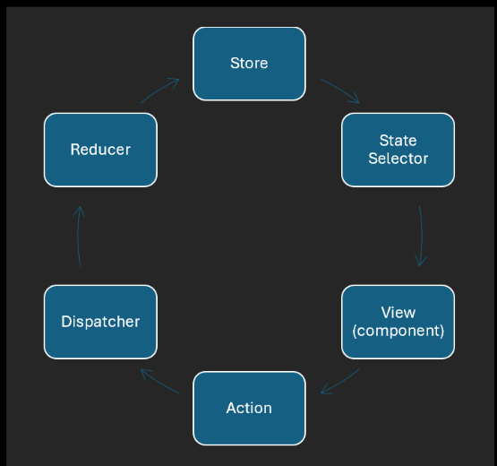

# React Redux

### What is Redux?
- `Redux` is a JavaScript framework.
- A set of functions and rules for managing state variables.
- State variables are stored in a central location instead of individual components.
- Eliminates the need for parent components to pass communication callbacks to children.

### Review - communication between parent and child components
```js
<SignInArea>
    <SignInModal onSignIn={handleSignIn} /> 
    <SignOutModal onSignOut={handleSignOut} /> 
</SignInArea>
```
- A callback function is passed so the child component can communicate with its parent.
- `SignInArea` - parent component that passes callback functions to its children.
- `SignInModal` - child component that activates the callback on sign in.
- `SignOutModal` - child component that activates the callback on sign out.
- The purpose of the callback is to change a state variable in the parent component.

### Redux centrally stored state variables
- Redux state variables are centrally stored.
- A child component can change a state variable that the parent uses.
- A parent component can change a state variable that a child uses.
- Parent and child components can communicate with centrally stored state variable instead of callbacks.

### Redux Store
- Store is the Redux object that stores state variables

1. Install `@reduxjs/toolkit` for the frontEnd as it works with React.
2. Create the module `store.ts` in a folder called `redux`.
3. Import `configureStore` into `store.ts`.
4. `const store = configureStore(storeOptions);`.

### Redux Store options
```js
const storeOptions:ConfigureStoreOptions = {reducer};
const store = configureStore(storeOptions);
```
- The options object is the datatype `ConfigureStoreOptions` which has a reducer property

1. `const storeOptions = {};`.
2. Assert the type to `ConfigureStoreOptions`.
3. Add the `reducer` property.

### Redux Reducer
- The `reducer` is function that can change state variables in the Redux `store`.
- To properly create a reducer that Redux expects, use the function `createSlice`.
- NOTE: it takes in many values and reduces it into 1 value.

### Redux Slice
- A `slice` is an object that contains state variables and reducers that change them.

1. Import `createSlice`.
2. `const slice = createSlice(sliceOptions);`.

### Slice options
```js
const sliceOptions: CreateSliceOptions = {
    name: "global", //describe the state
    initialState: stateVariables,
    reducers: ???,
};
```
- The options object defines state variables and reducers.

1. `const sliceOptions = {}`.
2. Assert the datatype as `CreateSliceOptions`.
3. Add these properties:` name, initialState, reducers`.
4. Let the name describe the state variables - `name: "global"`.
NOTE: mouseover the errors underlined in red to see typescript intellisense tips to tell what is missing/needed for your functions/variables/etc.

### Slice initial state
```js
export const stateVariables = {
    didMount: false,
    clickCount: 0,
    message: "Hello world!",
};
```
- The initial state declares state variables with key/value pairs.

1. In the redux folder, create a file called `stateVariables.ts`.
2. Export an object of state variables as key/value pairs.
3. Import `stateVariables` into `store.js` and set - `initialState: stateVariables`.

### Slice reducers
```js
function (state, action)
```

- A slice `reducer` is function that accepts a `state` and `action` object.
- The function changes the `state` based on the `action`.
- The `state` object will contain state variables as key/value pairs.
- The `action` object will contain the new value for a state variable.
- The `state` and `action` objects will be provided by Redux.

### Slice reducers as setters
```js
didMount: function (state, action) {};
clickCount: function (state, action) {};
message: function (state, action) {};
```
- Later we will observe how they work and how to program them
- We will program the reducers to be setters - functions that set their state variable.
- The function name will be same name as the state variable (instead of starting with set).

1. Create the file `stateSetters.ts` and `export const stateSetters = {}`.
2. Add methods that match the state variables: `didMount`, `clickCount`, `message`.
3. Let their values be an `anonymous` function that accepts a `state` and an `action` object.
4. Add a debugger to each function for now.
5. These functions will be activated later by components.

### State custom type
```js
type StateVariables = typeof stateVariables`
```
-Use the `typeof` keyword to create a custom type for state
variables

1. In `stateVariables.ts` create a custom type called
`StateVariables`.
2. Export the custom type.
3. Assert the custom type to state obiects in slice reducers.

### Slice reducer method
```js
const storeOptions = { reducer: slice.reducer };
```
- The `slice` object will have a `reducer` property.
- The `reducer` activates a `state setter` when a component wants to set a `state`.

1. In `store.ts`, update `storeOptions`.
2. Let the reducer be `slice.reducer`.
3. In `store.ts` `sliceOptions`, set `reducers` to `stateSetters`.

### Flux philosophy
`Store > State Selector > View(component) > Action > Dispatcher > Reducer then back to the beginning at Store`



 `Flux` is a philosophy that describes how data should flow in a single direction. Facebook came up with this concept. 

1. The component should tell the `dispatcher` which action to perform.
2. The `dispatcher` uses the correct reducer to perform the action.
3. The results of changing `state` variables are saved in the `store`.
4. Components can select and use `state` variables from the `store`.

### Redux implements Flux philosophy
Flux is the design while Redux is the code that implements Flux design.
  
- `useSelector`: A React hook for accessing a state variable in the store.
- `useDispatch`: A React hook that gives components access to the dispatcher.
- `slice.actions`: An object that contains actions that the dispatcher can perform.
- `<Provider>`: A React component that gives child components access to the Redux .store.
  
### Provider component
```js
<Provider store={store}>
```
- The `Provider` component gives components access to the Redux store and hooks.

1. Install `react-redux` which provides React utilities that work with Redux as a dependency that the app requires.
1. In `index.tsx`, import the `Provider` component and the Redux `store`.
2. Place components as children of `Provider` if they need access to Redux state variables.
3. Let the `store` attribute of the `Provider` component be the Redux `store`.

### useSelector
```js
const didMount = useSelector(callback);
```
- This `useSelector` hook selects a state variable in the Redux store.

1. `import { useSelector } from "react-redux";`.
2. Add the `useSelector` hook to a component.
3. Store the return value in a variable that matches the state variable to be selected.
4. Let `useSelector` accept a callback function.

### Selector function
```js
function selectDidMount(state)
function selectDidMount(state: StateVariables) {}
```
- The callback function is called the `selector`.
- The `selector` receives all the `state` variables from Redux, then returns a `state` variable.
- The naming convention is to start with `select`, then camelCase the `state` variable to `select`.

1. Create an empty `selector` function that accepts a `state` object and assert the type.
2. Let this `selector` function be the callback for the `useSelector` hook.

### Selector function implementation
```js
function selectDidMount(state: StateVariables) {
    debugger;
    const didMount = state.didMount;
    //const { didMount } = state;
    return didMount;
}
```
- Code the selector function to select and return a state variable.

1. Use the `debugger` to view the `state` object.
2. Use dot notation or destructuring to select a state variable from the state object.
3. Return the selected state variable.
4. Confirm that the component receives the state variable.

NOTE: Remember that webpack server does not `build` in the `dist` folder, only in memory. Need to run the `build` script to actially `build` in `dist`.

### State selectors
```js
export function selectDidMount(state: StateVariables)
```
-Create a file to export state selectors so other components have easy access to them

1. Create `stateSelectors.ts` in the `redux ` folder.
2. Add a `selector` function for each state variable in the Redux store.
3. Export each `selector` function.
4. Import `selector` functions wherever they are needed to access state variables.

### useDispatch
```js
const dispatch = useDispatch();
```
- This hook returns a `dispatch` function which is used to change state variables.

1. Import `useDispatch` and add it into a component.
2. In the mount phase, use the `dispatch` function.
3. Let the `dispatch` function take in an action object.

### Slice actions
```js
export const set = slice.actions;
```
- The Redux slice contains actions that the dispatcher can accept.
- The actions will be used to set the values of state variables.

1. In `store.ts`, `export const set = slice.actions;`.
2. Use the `debugger` to view the actions.
3. Observe the dot notation that would be used to set a state variable.

### Dispatch an action
```js
const action = set.didMount (true);
dispatch(action);
```
1. In components that use the dispatcher, import `set` from `store.ts`.
2. Next to the `dispatch` function, use dot notation to select a state variable in `set`.
3. Pass in the new value for the state variable and save the return value as the `action`.
4. Use the `debugger` to follow the dispatcher into a `reducer` (`stateSetters`).

###  Action payload
```js
const newValue = action.payload;
state.didMount = newValue;
```
- The `action` object contains the new value of the state variable.
- In a `reducer`, set a state variable to the value in the payload.

1. `const newValue = action.payload`.
2. Change the value of a state variable to the new value.
3. Code and make sure the other reducers work properly.

### Redux workflow summary
1. Create a Redux `store` and use `<Provider>` so the `store` is accessible to components.
2. Add state variables to the `store` and create a selector for each state variable.
3. With `useSelector`, components can select state variables.
4. With `set` object actions, components can request for state variables to change.
5. With `useDispatch`, the dispatcher can send actions to the correct reducers.
6. The reducers set the new values of state variables, then update them in the Redux store.

### Redux DevTools
- A browser extension that shows a history of state variables and how they changed.

1. Install the `Redux DevTools` extension into your browser.
2. Cause states to change in your app.
3. Open the extension in the browser `dev tools`.
4. Press play and observe how state variables were changed by components.
5. 
### Redux Item Practice 04-14-2025
- Create a global state variable for an item and dispatch an action to change its quantity

1. Add a component called `<Shop>` which will be like an online shop
2. Add 1 shop item in a Bootstrap card with an image and description
3. Add increment and decrement buttons for changing the item quantity
4. Add `quantity` to `stateVariables.ts` and set the initial value to 0
5. Add `selectQuantity` to `stateSelectors. ts `and code the selector
6. In `<Shop>`, select and display the `quantity` state variable from the Redux store
7. Add `quantity` to `stateSetters.ts` and code the reducer
8. In `<Shop>`, add handlers for the increment and decrement buttons
9. In each handler, create an action to set a new `quantity` value
10. Dispatch the action and confirm proper results

### Redux Cart Practice 04-15-2025
- Create a global state variable for a shopping cart and change the total quantity

1. Add a component called `<Cart>` which will be like an online shopping cart
2. Let it render a cart from Bootstrap icons and a small Bootstrap badge
3. Add `totalQuantity` to `stateVariables.ts` and set the initial value to 0
4. Add select`TotalQuantity` to `stateSelectors.ts` and code the selector
5. In `<Cart>`, select and display the `totalQuantity`  into the Bootstrap badge
6. Add `totalQuantity`  to `stateSetters.ts` and code the reducer
7. Increment the shop item from the previous practice by clicking the increment button
8. In the increment and decrement handlers, create an action for `totalQuantity` 
9. Dispatch the action and confirm proper results
10. Create another item and properly set its quantity and the `totalQuantity`    

### Redux Category Practice 04-16-2025
- Separate global state variables into categories that represent which page they're on

1. In `stateVariables. ts` add a property (category) for each page (ex: home, about)
2. Add `didMount` to each category and move state variables to their proper category
3. For state variables that don't belong to a single page, put them in the `global` category
4. Update `stateSelectors.ts` with names that match categories (ex. homeDidMount)
5. Update the selectors code to return a categorized state variable
6. Use the updated selectors for bringing state variables into components
7. Update `stateSetters.ts` with names that match categories (ex. homeDidMount)
8. Update the setters code to update the value of a categorized state variable
9. Use the updated set object to create actions
10. Dispatch the actions and confirm proper results

### Non-serializable states
- Non-serializable states are objects that cannot be stringified.
- For Redux Dev Tools compatibility, Redux does not allow non-serializable states.

``` js
let component: any = useSelector(selectComponent);
if (component === "Carousel") component = <Carousel />;
```

1. Observe an error when stringifying a component or storing it into a Redux state.
2. Store a placeholder for the non-serializable object (ex. "Carousel" or "ImageMap").
3. Restore the non-serializable object after selecting (ex. <Carousel /> or <ImageMap />).

